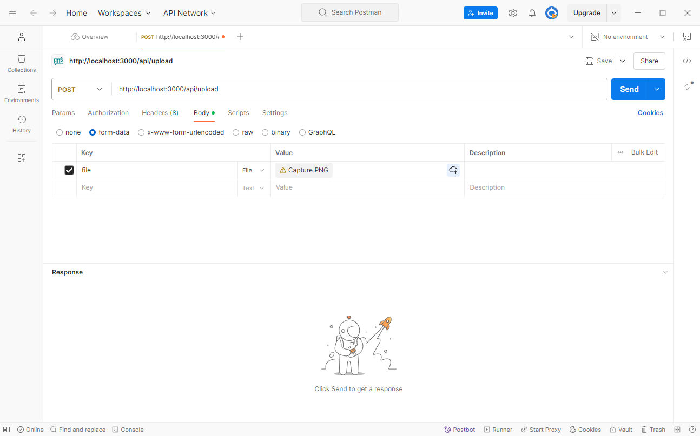

# File Upload in Node.js with TypeScript, Express, and Multer

This repository demonstrates how to set up a file upload system in a Node.js application using Express, Multer, and TypeScript. There are two branches available to suit different project setups:

- **`backend-only`**: This branch contains the backend setup only, focusing solely on the API without any frontend template.
- **`with-ejs-template`**: This branch extends the backend setup with an EJS template, providing a simple HTML interface for file uploads.

---

## Branches

### 1. **backend-only**

In this branch, the project is configured as a backend-only API that handles file uploads via a REST API endpoint. This setup is useful for scenarios where you want to integrate the backend with a separate frontend framework (e.g., React, Angular) or mobile application.

- **Main Files**:
  - **`src/index.ts`**: Initializes the Express server and sets up routes for file uploads.
  - **`src/routes/fileRoute.ts`**: Defines the `/api/upload` endpoint to handle file uploads.
  - **`src/controllers/fileController.ts`**: Contains the logic to process and stream the uploaded files.
- **Testing**: You can test the file upload functionality using API testing tools like **[Postman](https://www.postman.com/)** or **[Insomnia](https://insomnia.rest/)**.



### 2. **with-ejs-template**

In this branch, the backend is extended with an EJS template, adding a simple HTML interface to upload files directly from the browser. This is helpful if you prefer a minimal frontend interface for uploading files without setting up a separate frontend framework.

- **Main Files**:
  - **`src/index.ts`**: Sets up Express and configures EJS as the view engine to render frontend templates.
  - **`src/views/uploadForm.ejs`**: An EJS template with a file upload form, styled with Bootstrap, and a modal to display the uploaded file.
  - **`src/routes/fileRoute.ts`**: Defines the `/api/upload` endpoint to handle file uploads, as well as a root route (`/`) to render the form.
  - **`src/controllers/fileController.ts`**: Processes uploaded files and streams them back to the client.

- **Frontend Template**:
  - The file upload form in `uploadForm.ejs` allows users to select a file and upload it directly from the browser. After upload, the file can be previewed in a modal.

---

## Getting Started

To get started, clone the repository and switch to the branch you need:

```bash
git clone https://github.com/dev-luckymhz/upload-file-node.js-typescript.git
cd upload-file-node.js-typescript

# Checkout the branch you want to use
git checkout backend-only    # For backend-only API
# OR
git checkout with-ejs-template  # For EJS frontend interface
```

### Install Dependencies

```bash
npm install
```

### Running the App

To start the application, run:

```bash
npm run dev
```

- The backend-only branch exposes only the `/api/upload` endpoint.
- The `with-ejs-template` branch provides an EJS form at `http://localhost:3000/` for uploading files directly from the browser.

---

## License

This project is open-source and available under the MIT License.